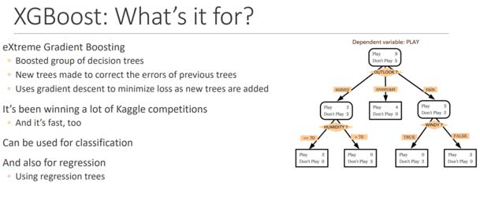

Monday, January 27, 2025 1:27 PM

**Shapley values provide a local explanation by quantifying the
contribution of each feature to the prediction for a specific instance,
while PDP provides a global explanation by showing the marginal effect
of a feature on the model's predictions across the dataset. Use Shapley
values to explain individual predictions and PDP to understand the
model\'s behavior at a dataset level**

Confusion matrix is a tool specifically designed to evaluate the
performance of classification models by displaying the number of true
positives, true negatives, false positives, and false negatives. This
matrix provides a detailed breakdown of the model\'s performance across
all classes, making it the most suitable choice for evaluating a
classification model\'s accuracy and identifying potential areas for
improvement.

**Root Mean Squared Error (RMSE)** ‐ Root Mean Squared Error (RMSE) is a
metric commonly used to measure the average error in regression models
by calculating the square root of the average squared differences
between predicted and actual values. However, RMSE is not suitable for
classification tasks, as it is designed to measure continuous outcomes,
not discrete class predictions.

**Mean Absolute Error (MAE)** ‐ Mean Absolute Error (MAE) measures the
average magnitude of errors in a set of predictions without considering
their direction. MAE is typically used in regression tasks to quantify
the accuracy of a continuous variable\'s predictions, not for
classification tasks where the outputs are categorical rather than
continuous.

**Correlation matrix** ‐ Correlation matrix measures the statistical
correlation between different variables or features in a dataset,
typically used to understand the relationships between continuous
variables. A correlation matrix is not designed to evaluate the
performance of a classification model, as it does not provide any
insight into the accuracy or errors of categorical predictions.

**Sampling bias**\
This is the correct answer because sampling bias occurs when the data
used to train the model does not accurately reflect the diversity of the
real‐world population. If certain ethnic groups are underrepresented or
overrepresented in the training data, the model may learn biased
patterns, causing it to flag individuals from those groups more
frequently. In this scenario, sampling bias leads to discriminatory
outcomes and unfairly targets specific groups based on ethnicity.

**Measurement bias** ‐ Measurement bias is not the correct explanation
because it involves inaccuracies in data collection, such as faulty
equipment or inconsistent measurement processes. This type of bias does
not inherently affect the demographic composition of the dataset and,
therefore, is not directly responsible for bias based on ethnicity in
the model\'s outputs.

**Observer bias** ‐ Observer bias is irrelevant in this context because
it relates to human errors or subjectivity during data analysis or
observation. Since the AI model processes the data autonomously without
human intervention, observer bias is not a factor in the biased outcomes
of the model.

**Confirmation bias** ‐ Confirmation bias involves selectively searching
for or interpreting information to confirm existing beliefs. This type
of bias does not apply to the AI system in this scenario, as there is no
indication that the model is designed to reinforce any preconceptions or
assumptions related to ethnicity.

**Top K**\
Top K represents the number of most likely candidates that the model
considers for the next token. Choose a lower value to decrease the size
of the pool and limit the options to more likely outputs. Choose a
higher value to increase the size of the pool and allow the model to
consider less likely outputs.

**Temperature** ‐ Temperature is a value between 0 and 1, and it
regulates the creativity of the model\'s responses. Use a lower
temperature if you want more deterministic responses, and use a higher
temperature if you want more creative or different responses for the
same prompt on Amazon Bedrock.

**Top P** ‐ Top P represents the percentage of most likely candidates
that the model considers for the next token. Choose a lower value to
decrease the size of the pool and limit the options to more likely
outputs. Choose a higher value to increase the size of the pool and
allow the model to consider less likely outputs.

**Decision Trees**\
Decision Trees are highly interpretable models that provide a clear and
straightforward visualization of the decision‐making process. Decision
Trees work by splitting the data into subsets based on the most
significant features, resulting in a tree‐like structure where each
branch represents a decision rule.

**Logistic Regression** ‐ Logistic Regression is primarily designed for
binary classification problems. While it can be adapted for multiclass
classification, it may not perform effectively with a large number of
categories or a complex dataset like a massive movie database.
Additionally, logistic regression does not provide an easily
interpretable structure that illustrates how each feature influences the
final output, making it less suitable for the company\'s requirements.

> AWS AI Prctitioners Page 1

**Neural Networks** ‐ This option is incorrect because, although neural
networks are powerful tools for handling large and complex datasets,
they are often considered \"black‐box\" models due to their lack of
transparency. Neural networks involve multiple layers of neurons and
nonlinear transformations, making it difficult to understand and
document the inner workings of the model. Given the company's need for
transparency and an understanding of how the model affects the output,
neural networks are not the best choice.

**Support Vector Machines (SVMs)** ‐ This option is incorrect because,
while SVMs are effective for classification tasks, especially in
high‐dimensional spaces, they do not inherently provide an interpretable
way to understand the decision‐making process. SVMs create a hyperplane
to separate classes, but it is not straightforward to explain how
individual features impact the final classification. This lack of
interpretability makes SVMs less suitable for a company that wants to
document and understand the inner workings of the model.

Model parameters are values that define a model and its behavior in
interpreting input and generating responses. Hyperparameters are values
that can be adjusted for model customization to control the training
process.

Image processing focuses on enhancing and manipulating images for visual
quality, whereas computer vision involves interpreting and understanding
the content of images to make decisions

Feature engineering for structured data often involves tasks such as
normalization and handling missing values, while for unstructured data,
it involves tasks such as tokenization and vectorization

Interpretability is about understanding the internal mechanisms of a
machine learning model, whereas explainability focuses on providing
understandable reasons for the model\'s predictions and behaviors to
stakeholders

ChatGPT or Chat Generative Pretrained Transformer is an example of a
Transformer model. Transformer‐based models use a self‐attention
mechanism. They weigh the importance of different parts of an input
sequence when processing each element in the sequence.

**Amazon Q in Connect**\
Amazon Connect is the contact center service from AWS. Amazon Q helps
customer service agents provide better customer service. Amazon Q in
Connect uses real‐time conversation with the customer along with
relevant company content to automatically recommend what to say or what
actions an agent should take to better assist customers.

Incorrect options:\
**Amazon Q Developer** ‐ Amazon Q Developer assists developers and IT
professionals with all their tasks---from coding, testing, and upgrading
applications, to diagnosing errors, performing security scanning and
fixes, and optimizing AWS resources.

**Amazon Q Business** ‐ Amazon Q Business is a fully managed,
generative‐AI powered assistant that you can configure to answer
questions, provide summaries, generate content, and complete tasks based
on your enterprise data. It allows end users to receive immediate,
permissions‐aware responses from enterprise data sources with citations,
for use cases such as IT, HR, and benefits help desks.

**Amazon Q in QuickSight** ‐ With Amazon Q in QuickSight, customers get
a generative BI assistant that allows business analysts to use natural
language to build BI dashboards in minutes and easily create
visualizations and complex calculations.

Data access control involves authentication and authorization of users,
whereas data integrity ensures the data is accurate, consistent, and
unaltered

Model training in deep learning involves using large datasets to adjust
the weights and biases of a neural network through multiple iterations,
using techniques such as gradient descent to minimize the error

Neural networks consist of layers of nodes (neurons) that process input
data, adjusting the weights of connections between nodes through
training to recognize patterns and make predictions

SageMaker model cards include information about the model such as
intended use and risk rating of a model, training details and metrics,
evaluation results, and observations. AI service cards provide
transparency about AWS AI services\' intended use, limitations, and
potential impacts

Feature extraction reduces the number of features by transforming data
into a new space, while feature selection reduces the number of features
by selecting the most relevant ones from the existing features

K‐Means is an unsupervised learning algorithm used for clustering data
points into groups, while KNN is a supervised learning algorithm used
for classifying data points based on their proximity to labeled examples

While CNNs are used for single image analysis, RNNs are used for video
analysis

Convolutional Neural Networks (CNNs) are specifically designed for
processing and classifying image data.

**Recurrent Neural Networks (RNNs)** ‐ Recurrent Neural Networks (RNNs)
are typically used for sequence data, such as time series or natural
language processing tasks. RNNs are not the best fit for image
classification.

**Generative Adversarial Networks (GANs)** ‐ Generative Adversarial
Networks (GANs) are used for generating new data that resembles the
training data, such as creating realistic images, but are not
specifically designed for image classification

Precision, Recall, and F1‐Score are standard performance metrics used to
evaluate the effectiveness of a classification system:

**Mean Absolute Error (MAE), Root Mean Squared Error (RMSE) and
R‐squared** ‐ Mean Absolute Error (MAE), Root Mean Squared Error (RMSE),
and

> AWS AI Prctitioners Page 2

R‐squared are metrics used to evaluate regression models, not
classification systems.

**Throughput, Latency and Uptime** ‐ Throughput, Latency, and Uptime are
performance metrics used to measure system performance and reliability,
not specific to classification systems.

**Bias and Variance** ‐ Bias refers to the error introduced by
approximating a real‐world problem, which may be complex, with a
simplified model.

In traditional machine learning, a data scientist manually determines
the set of relevant features that the software must analyze, whereas in
deep learning, the data scientist gives only raw data to the software
and the deep learning network derives the features by itself

Deep learning is a subset of machine learning that uses neural networks
with many layers to learn from large amounts of data, while traditional
machine learning algorithms often require feature extraction and can use
various methods such as decision trees or support vector machines

Diffusion models create new data by iteratively making controlled random
changes to an initial data sample

Risk management in the Generative AI Security Scoping Matrix involves
identifying potential threats to generative AI solutions and
recommending mitigations. It encompasses activities like risk
assessments and threat modeling, which are essential for understanding
and addressing the unique risks associated with generative AI workloads.

Top‐p limits the number of tokens based on their cumulative
probabilities, while top‐k specifies a fixed number of most probable
tokens to consider.

The provisioned throughput model is designed for steady workloads,
offering consistent performance with pre‐purchased units of token
processing capacity.

AI agents do not manually code rules. They operate based on predefined
rules or learning algorithms. The whole purpose of AI agents is to
automate tasks and make decisions without manual intervention, so coding
new rules manually is not a task they perform.

The correct role of the discriminator in a Generative Adversarial
Network (GAN) is to evaluate and classify data as real or fake. By
providing feedback to the generator based on its classification, the
discriminator helps improve the quality of the generated data over time.

Early stopping prevents overfitting, while a validation set ensures that
the model generalizes to new data

**Automated Data Discovery** This feature allows organizations to
automatically identify and classify sensitive data, such as personally
identifiable information (PII) and financial data, within their Amazon
S3 buckets. It helps in protecting sensitive data by continuously
monitoring and alerting on potential security risks or policy
violations.

**S3 Object Lock** S3 Object Lock is a feature of Amazon S3 that allows
organizations to enforce write‐once‐read‐many (WORM) policies on their
objects, preventing them from being deleted or overwritten for a fixed
amount of time. While it helps in protecting data from accidental or
malicious deletion, it does not discover or classify sensitive data.

**Access Analyzer**\
It is part of **AWS Identity and Access Management (IAM) Access
Analyzer**, which is designed to help you analyze and monitor access to
your AWS resources. **AWS IAM Access Analyzer** enables you to identify
resources in your organization or account, such as S3 buckets, KMS keys,
Lambda functions, and more, that are shared with external entities (like
other AWS accounts or publicly). It generates findings based on resource
policies to help you understand unintended access or overexposed
resources.

**Content moderation** Content moderation in Amazon Rekognition is the
correct service to utilize for ensuring that user‐uploaded images do not
contain any inappropriate content. This service uses machine learning
models to detect explicit or suggestive content, violence, and other
inappropriate material in images, making it ideal for the social media
platform\'s needs

**Transparency** Transparency ensures that the AI model\'s decisions and
processes are understandable and explainable, which is key to detecting
and correcting potential biases.

Safety Safety ensures the model avoids harmful outcomes.

**Veracity** Veracity focuses on reliability and accuracy.

**Scalability** Scalability refers to the ability of the AI system to
handle increasing amounts of work or to be expanded across different
environments. While important, it is not directly related to the
fairness or explainability of the model.

**Fairness** Fairness is a core dimension of responsible AI that ensures
the model treats all individuals and groups equally and does not
discriminate against any particular group. It involves promoting
inclusiveness and addressing biases in the training data and model
algorithms.

Amazon Comprehend Medical has the ability to automatically detect and
remove Protected Health Information (PHI) from medical documents. This
is crucial for compliance with privacy laws like HIPAA, which mandate
the removal of identifiable patient information in certain contexts.
De‐identification ensures that healthcare organizations can analyze data
while safeguarding patient privacy.

**AWS Security Hub** AWS Security Hub is the correct choice as it helps
you gain insight into the security posture of your AWS environment by
providing a unified view of security data from various AWS services. It
aggregates, organizes, and prioritizes security findings from multiple
AWS services such as Amazon GuardDuty, Amazon Inspector, and AWS Macie.

> AWS AI Prctitioners Page 3

**Generator in GAN** The generator is responsible for creating fake data
that mimics the real data. It learns to produce data that becomes
increasingly realistic over time as it receives feedback from the
discriminator.

**High temperature, high Top P** High temperature introduces randomness
for creativity, and high Top P allows for a broader range of words while
still limiting unlikely tokens. This combination ensures diverse yet
plausible outputs.

**The harmonic mean of precision and recall, balancing both precision
and recall** The **F1 score** is the **harmonic mean of precision and
recall**, balancing the trade‐off between the two metrics. It gives
equal weight to both precision and recall, making it useful for
evaluating models where false positives and false negatives are equally
important.

SageMaker Autopilot automatically builds, trains, and tunes machine
learning models, allowing users to get predictions without needing deep
knowledge of machine learning.

Slot types are used to define parameters that must be collected from the
user (e.g., account number, inquiry reason) to complete the intent.
**Intents** Intents represent the user's goal or action, such as
\"report an issue,\" but they do not collect specific details required
to fulfill the intent.

**Fallback intents**Fallback intents are used when the bot cannot
recognize the user's input, not for gathering specific information.\\

**Generative Adversarial Networks (GANs)**\
Generative Adversarial Networks (GANs) are a type of deep learning model
that consists of two neural networks, a generator, and a discriminator,
that work together to generate new data samples. GANs are a common
example of generative AI technology as they are used to create realistic
synthetic data.

**K‐Nearest Neighbors (KNN)**\
K‐Nearest Neighbors (KNN) is a simple algorithm used for classification
and regression tasks in machine learning. It is not considered
generative AI technology as it does not generate new data points but
rather makes predictions based on existing data points.

**Decision Trees**\
Decision Trees are a type of supervised machine learning algorithm used
for classification and regression tasks. They are not considered
generative AI technology as they do not generate new data points but
rather make decisions based on existing data.

On‐demand serverless inference is ideal for workloads with idle periods
and traffic spikes. Its advantage is automatic scaling, which reduces
management overhead by handling the underlying infrastructure
automatically. However, it can potentially incur higher costs during
peak usage times due to the dynamic scaling.

K‐fold Cross Validation for Overfitting‐‐‐ Split your data into K
randomly‐assigned segments ◦Reserve one segment as your test data ◦Train
on each of the remaining K‐1 segments and measure their performance
against the test set ◦Take the average of the K‐1 r‐squared scores

Unsupervised lerning: K‐Means Clustering ◦We start by picking K
centroids at random ◦Assign each point to the closest centroid
◦Recompute each centroid based on chosen points ◦Iterate until
assignments don't change

What is regularization? Preventing overfitting

Bias is how far removed the mean of your predicted values is from the
"real" answer Variance is how scattered your predicted values are from
the "real" answer

> AWS AI Prctitioners Page 4

Self attention‐ 1 word 2 meaning

**Residual Neural Networks** (AKA ResNet) are normally used in **image
recognition. WaveNet** is used for generating audio, specifically for
**text‐to‐speech** applications.

**N‐grams (Sequences of N words used in BLEU and ROUGE metrics)**\
N‐grams are sequences of N words used in metrics like BLEU and ROUGE to
evaluate the similarity between text samples based on exact word
matches. They do not focus on the meaning of words in context, but
rather on the presence of specific word sequences.

**ROUGE (Recall‐Oriented Understudy for Gisting Evaluation)**ROUGE
(Recall‐Oriented Understudy for Gisting Evaluation) is a metric used in
natural language processing tasks to evaluate the quality of text
summaries based on exact word matches. It measures the overlap of words
between the generated summary and the reference summary, without
considering the context or meaning of the words.

**BLEU (Bilingual Evaluation Understudy)**\
BLEU (Bilingual Evaluation Understudy) is a metric commonly used in
machine translation tasks to evaluate the quality of translated text
based on exact word matches. It focuses on precision and recall of
matching words without considering the context or meaning of the words.

**BERTScore (Bidirectional Encoder Representations from Transformers
Score)**\
BERTScore (Bidirectional Encoder Representations from Transformers
Score) is a metric that focuses on evaluating the quality of text based
on the meaning of words in context rather than exact word matches. It
uses pre‐trained contextual embeddings from BERT models to capture the
semantic similarity between words and sentences, making it a more
advanced and context‐aware metric compared to BLEU and ROUGE.

Topic‐specific controls enable administrators to block entire topics,
such as employee salaries, ensuring that the AI assistant does not
provide information on sensitive subjects.

Dimension reduction techniques, such as Principal Component Analysis
(PCA), reduce the number of input variables by transforming them into a
smaller subset of features. This helps in simplifying the model,
preventing overfitting, and improving performance by focusing on the
most important information.

> AWS AI Prctitioners Page 5

Model explainiblity‐ Sagemaker clarify

AWS AI Prctitioners Page 6

AWS AI Prctitioners Page 7

Deploy multiple models behind a single endpoint\
◦SageMaker Inference Pipeline

Enable model observability and tracking\
◦SageMaker Model Monitor, CloudWatch, Clarify, Model Cards, lineage
tracking

Synchronize architecture and configuration, and check for skew across
environments ◦CloudFormation, Model Monitor

Restrict access to intended legitimate consumers\
◦Secure inference endpoints

Monitor human interactions with data for anomalous activity\
◦Logging, GuardDuty, Macie

**SageMaker Blue/Green Deployments allow for testing new features
gradually and safely by routing a portion of traffic to the new version
while**

**keeping the old version running, ensuring controlled deployment and
rollback capabilities.**

> AWS AI Prctitioners Page 8

Guardrail‐ content filtering in gen ai & rollback deployment in
sagemaker model deployment Shadow stte‐ 2 servers running parallely,
comparing performance

AWS AI Prctitioners Page 9

AWS AI Prctitioners Page 10

What is the main function of SageMaker Neo? ‐ to optimize the models for
deployment on edge devices

Data lineage and provenance refer to the process of tracking the origin,
transformations, and flow of data throughout its lifecycle. It helps
organizations understand where data comes from, how it has been used,
and how it has been transformed over time.

**Synonym support**\
Synonym support in Amazon Kendra enables users to define synonyms for
search terms to improve the accuracy of search results. While it
enhances the search experience, it does not directly track user
interactions with the search results.

**User activity tracking**\
User activity tracking is a general term used to monitor and record user
interactions within a system. While it is crucial for understanding user
behavior, it is not a specific feature within Amazon Kendra for tracking
how users interact with search results.

**Relevance tuning**\
Relevance tuning in Amazon Kendra allows users to adjust the search
results based on their preferences and feedback. While it is important
for optimizing search results, it is not specifically designed to track
user interactions with the search results.

**Search analytics**\
Search analytics in Amazon Kendra provides insights into how users
interact with search results, including metrics such as popular search
queries, click‐through rates, and user engagement. This feature is
specifically designed to track and analyze user interactions, making it
the correct choice for monitoring user behavior in the search results.

VAEs generate data by sampling from a learned distribution, typically a
Gaussian distribution in the latent space. This sampling process allows
VAEs to generate new data points that are similar to the training data.
In contrast, GANs use adversarial training between a generator network
that creates fake data samples and a discriminator network that tries to
distinguish between real and fake samples.

Amazon GuardDuty continuously monitors for malicious activity and
unauthorized behavior, enhancing the security of an AWS
environment.\\\\\\

A high NPS indicates high user satisfaction, as it measures the
likelihood of users recommending the AI application to others.

AI systems, especially large language models and generative AI, are
inherently complex and often operate as \"black boxes,\" making it
difficult to audit and understand their decision‐making processes. This
complexity necessitates ongoing monitoring and adaptability to ensure
compliance, which is less of an issue in traditional software systems

Comprehend

> AWS AI Prctitioners Page 11

Personalize = recommendation or ranking personalize

In Bedrock agent, code interpretor , writes its own code.\
Evaluation of model= benchmark, human, another model\
Similarity metrics\
Rouge ‐ Recall\
BLUE= precision\
BERTscore‐ google, embedding, semantic\
Precsion ML metrices, precision, accuracy, recall, f1\
‐‐Positives

AWS AI Prctitioners Page 12

‐‐Negatives\
\\ True\
/ false

Below r for classification\
Recall‐ sensitivity, fraud detection... \|\
Precision ‐ relevant, drug detection ‐‐‐

ROC cureve, more upper, more good

For regression== rmse, mae, r2

Shapley‐ one feature contributing how much

Transparency ‐ how\
Explainibility ‐ y\
Intrepretability = cause

AWS AI Prctitioners Page 13

SHAP (SHapley Additive exPlanations) is the technique used by SageMaker
Clarify to measure the impact of each feature by evaluating the model\'s
performance with the feature left out.

**Precision**\
Precision focuses on the proportion of true positive predictions among
all positive predictions.

**F1 Score**\
The F1 Score is the harmonic mean of precision and recall, providing a
balance between the two metrics. While F1 Score considers both false
positives and false negatives, it may not be the best choice when the
cost of false negatives is significantly higher.

**Accuracy**\
Accuracy is not the best metric for evaluating the performance of the
model in this scenario because it treats false negatives and false
positives equally. Since the cost of a false negative is higher,
accuracy may not reflect the true impact of misclassifying churn
customers.

**Recall**\
Recall, also known as sensitivity, measures the proportion of actual
positive cases that were correctly identified by the model. In this
case, where false negatives are more costly, recall is crucial as it
prioritizes minimizing false negatives, making it the most suitable
metric for evaluating the model\'s performance.

**Bedrock Invocation Logging**\
Bedrock Invocation Logging is the feature that allows the firm to track
and analyze how frequently certain types of content are generated and
used.

Continue pre training also called domain adopting\\

Fine tuning is kind of transfer learning

Admin control‐ guardrails for amazon q business

> AWS AI Prctitioners Page 14

Ground ruth for reviewing

Ground truth plus for lbelling data

## 🚀 Follow Me on LinkedIn & My Newsletter!  

Hey there! I'm **Vineet Rana**, a passionate **DevOps Engineer** 💻☁️. Let's connect and grow together!  

🔗 **LinkedIn:** [Vineet Rana](https://www.linkedin.com/in/vineetrana)  

📩 **Subscribe to my Newsletter:** [The DevOps Chronicles](https://www.linkedin.com/build-relation/newsletter-follow?entityUrn=7276114874349375488)  

🔥 Stay updated with the latest in **DevOps, AWS, and automation!** 🚀  

