# 🚀 GitHub Actions Guide: Mastering Workflows & Automation 🤖

## 📌 Event-Based Workflow Execution
By specifying the event types as `[created, edited]`, the workflow will **only run** when branch protection rules are created or edited, ensuring that deletions do not trigger the workflow. 🔒✨

---

## 📦 GitHub Packages Supported Registries
GitHub Packages supports various package registries:

- 📦 **JavaScript** - Node Package Manager (**npm**)
- 💎 **Ruby** - RubyGems (**gem**)
- ☕ **Java** - Apache Maven (**mvn**)
- ⚙️ **Java** - Gradle (**gradle**)
- 🎯 **.NET** - NuGet (**dotnet**)
- 🐳 **Docker** - Container Management (**N/A**)

---

## ✅ Checks API: The Right Choice for Workflow Logs & Statuses
The **Checks API** is used by GitHub Actions to output **statuses, results, and logs** for workflows. It provides **detailed status checks, annotations, and summaries**. 📝📊

💡 **Other APIs and their purposes:**
- ⚡ **Actions API**: Manages GitHub Actions workflows (triggering, listing, and fetching details)
- ❤️ **Health API**: Checks GitHub’s service health status

---

## 🚨 Filtering Failed Workflow Runs
Want to **view only failed workflows**❓ Use the **"failure"** filter in the GitHub Actions tab to isolate failed runs. 🔍❌

---

## ⏳ Job Approval Timeout: 30 Days
If a **job is not approved within 30 days**, it will **automatically fail**. This ensures workflows don’t get stuck indefinitely. 🔄⏳

---

## 🔑 Scoped Installation Tokens for Security
GitHub provides **runners with scoped tokens** that have **read access** to the repository where the actions are stored. 
🔒 These tokens **expire after 1 hour** to maintain security.

---

## 👀 Viewing Workflow Run Status
You can check a **GitHub Actions workflow run status**:
1️⃣ **Before merging a pull request**
2️⃣ **In the pull request’s Checks tab**
3️⃣ **Within the GitHub Actions tab**

---

## ⚙️ GitHub’s "Set up job" & "Complete job" Steps
- 🛠️ **Set up job**: Prepares the environment before execution
- ✅ **Complete job**: Finalizes actions & cleans up resources after execution

---

## 🔄 Updating IP Allowlist for GitHub-Hosted Runners
Updating the **IP allowlist weekly** can be a hassle! 😓 Manually managing this is **error-prone and time-consuming**—automate it whenever possible! 🔄⚠️

---

## 🚫 Default Environment Variables Cannot Be Overwritten
**GITHUB_** & **RUNNER_** environment variables **cannot be modified** using `GITHUB_ENV`. 🔐 This restriction ensures workflow **integrity & security**. 🚀

---

## ⚖️ Using GitHub-Hosted vs. Self-Hosted Runners
💡 **Why mix both?**
- **GitHub-hosted runners** = Convenient but limited resources 🏎️
- **Self-hosted runners** = Higher compute power for resource-heavy tasks 💪🔥

---

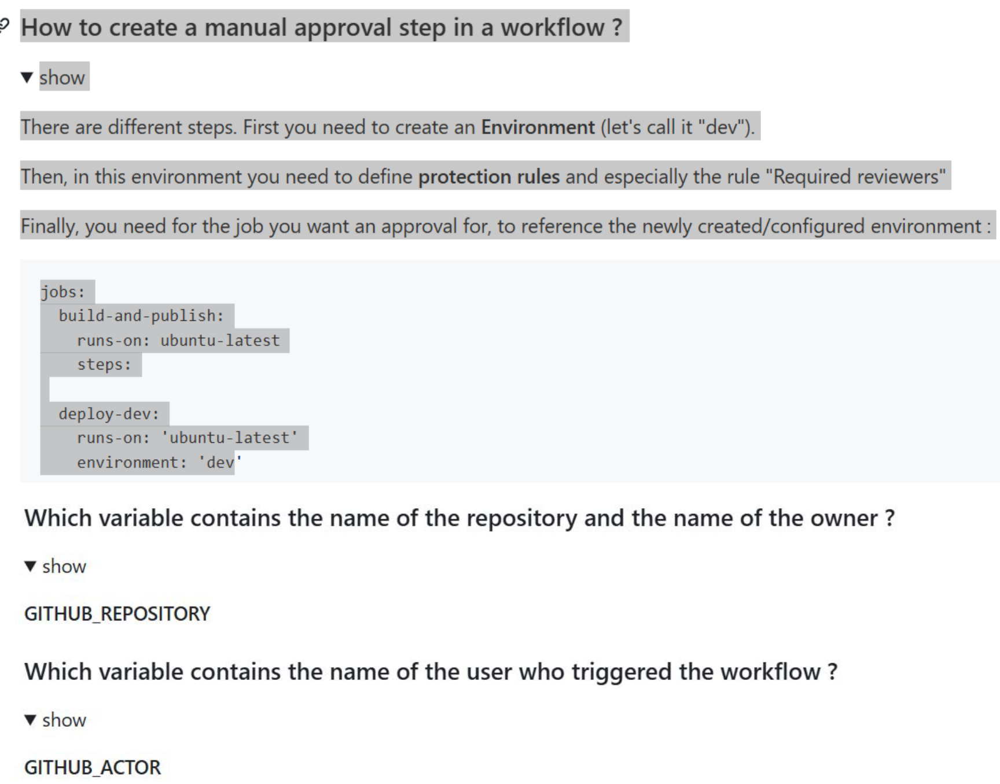{width="6.0in"
height="4.706944444444445in"}

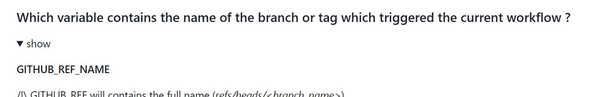{width="6.0in"
height="0.9819444444444444in"}


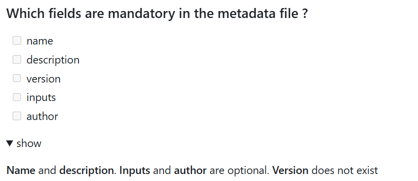{width="6.0in"
height="2.598611111111111in"}


## 🐳 Using Args in Docker Actions
Using **args** in the action metadata file allows you to **pass inputs** as arguments to a **Docker container**. 🚀 Inside the container, these arguments can be accessed as **environment variables**. 🛠️

# 🚀 GitHub Actions Best Practices & Tips 🤖✨

## 🔧 Fixing "Permission Denied" Errors in Entrypoint Scripts
If you encounter a **permission denied** error when running `entrypoint.sh`, modify the script to **explicitly set executable permissions** before execution. ✅

```bash
chmod +x entrypoint.sh
./entrypoint.sh
```

This ensures that the script runs as intended within the **Docker container action**. 🐳🔒

---

## 🏷️ Correctly Categorizing Actions in GitHub Marketplace
When drafting a **new release** and publishing an action to **GitHub Marketplace**, ensure that the **action’s metadata category matches an existing GitHub Marketplace category**. 📌

✅ This helps users discover and use your action effectively! 🚀

---

## 🔐 Storing Large Secrets ( >48 KB )
For secrets **larger than 48 KB**, use **GPG encryption**. 🔒

- The **encrypted file** is stored in the repository.
- The **decryption passphrase** is stored as a **GitHub Secret**.

```bash
gpg --encrypt --recipient "your-email@example.com" secret-file.txt
```

This keeps your secrets **secure and manageable**! 🔑

---

## 🔤 Environment Variables Are Case-Sensitive!
GitHub Actions **treats environment variables as case-sensitive**. Be mindful of naming conventions to **avoid conflicts**! 🖋️⚠️

---

## ✅ Understanding Exit Codes in GitHub Actions
- **0 (Zero)** = ✅ Success → Workflow continues
- **Non-Zero** = ❌ Failure → Cancels concurrent actions & skips subsequent tasks

This helps GitHub **accurately assess** workflow execution outcomes! ⚙️🔍

---

## 🐧 Running Docker Container Actions
Docker container actions **only work on Linux runners**. 🐳📌

- **GitHub-hosted runners** ✅
- **Self-hosted runners** ✅ (Must use Linux + Docker installed)

Ensure your **runner is properly configured** before executing container actions! 🏗️

---

## 🛡️ GitHub Automatically Redacts Secrets 🔒
To **protect sensitive information**, GitHub **automatically redacts secrets** printed in workflow logs. 🕵️‍♂️❌

Example:
```yaml
env:
  SECRET_KEY: ${{ secrets.MY_SECRET }}
```
Even if someone tries `echo $SECRET_KEY`, GitHub replaces it with `***` to prevent exposure. 🚀

---

## 📢 Triggering Workflows on Push & Tag Creation
Sam wants to **trigger a workflow when pushing to any branch or creating a tag**. 
Here’s how to specify these events in a GitHub workflow: 📌

```yaml
on: [push, create]
```

This ensures that workflows **run automatically** on pushes or new tags! 🔄✅

---

## 🔍 Troubleshooting Self-Hosted Runner Connectivity
To check if a **self-hosted runner** can access GitHub services, use:

```bash
./config.sh --check
```

🔍 This validates **network access** and **authenticates the runner** using a token, ensuring smooth workflow execution. 🚀

---

## 📁 Best Practice: Organizing Custom GitHub Actions
When storing multiple custom actions in a GitHub repository, place them inside:

📂 `.github/actions/`

Each action should have **its own subdirectory** to maintain organization and clarity. 📌

Example Structure:
```
.github/
 ├── actions/
 │   ├── my-action-1/
 │   │   ├── action.yml
 │   │   ├── entrypoint.sh
 │   ├── my-action-2/
```
This keeps your repo **clean, structured, and easy to maintain!** 🏗️


# 🚀 GitHub Actions Guide

## 🔥 Caching and Restore Keys

- `restore-keys` allows specifying alternative keys to restore a cache if a cache miss occurs. 🔄

## 🛠️ Service Containers

- GitHub creates fresh Docker containers for each service in a workflow and destroys them after job completion. 🐳

## ⚡ Workflow Job Limits

- Maximum **256 jobs** can be generated by a matrix per workflow run. ⚙️

## 🕵️ Debugging in GitHub Actions

- Debug messages **are not displayed** in logs by default.
- To enable them, create a secret:
  ```yaml
  ACTIONS_STEP_DEBUG: true
  ```
- Use `::` prefixed workflow commands to modify the runner environment. 🛠️

## 📂 Organizing Logs

- `group` command helps organize logs into collapsible sections.
- `add-mask` masks values in logs.
- `stop-commands` prevents accidental execution of workflow commands. 📜

## 🚀 Triggering Workflows

- To trigger a workflow when a comment is created on an issue:
  ```yaml
  on:
    issue_comment:
      types: [created]
  ```

## 🎭 Variable Precedence

- Environment-level variables **override** repository and organization-level variables. 🔄
- GitHub converts input names to **UPPERCASE** and replaces spaces with `_`. 🔡

## ❌ Deleting Workflow Runs

- You can delete completed workflow runs older than **two weeks**. 🗑️

## 🔄 `check_suite` Event

- This event **only triggers workflows on the default branch**. 📌

## 🖥️ Self-Hosted Runners

- Connects to GitHub via **HTTPS long polling** (50 seconds timeout). 🔗
- No inbound GitHub connections required, but ensure network access to GitHub hosts. 🌐

## 📡 Service Containers in Workflows

- Enable external dependencies (e.g., databases) for testing. 🛠️

## 🔍 `GITHUB_ACTIONS` Variable

- Always set to `true` when running workflows inside GitHub Actions. ✅

## 📢 Publishing to GitHub Marketplace

### Steps to Publish an Action:
1. Navigate to the **repository main page**.
2. Locate `action.yml` or `action.yaml`.
3. Click **Draft a release**.
4. Select **Publish this Action to GitHub Marketplace**.
5. Ensure **GitHub Marketplace Developer Agreement** is accepted.
6. Fix any metadata file issues and select appropriate categories.
7. Add version tag, release title, and complete other fields.
8. Click **Publish release** (requires **2FA enabled**). 🔐

## 🔍 Debug Logging for Steps

- Set the repository secret or variable:
  ```yaml
  ACTIONS_STEP_DEBUG: true
  ```
- If both are set, **secret takes precedence**. 🛠️

## 🌐 Branch Matching with Glob Patterns

- Use `*`, `**`, `+`, `?`, `!` for flexible matching.
- Escape special characters with `\` for **literal matches**. 🎯

## 🔄 Push Event Filters

- Use **Glob** patterns to target multiple branches. 🔍

## 🚦 Managing Parallel Workflows

- Use `concurrency` to **cancel previous runs** and run only the latest:
  ```yaml
  concurrency:
    group: ${{ github.workflow }}-${{ github.ref }}
    cancel-in-progress: true
  ```

## 🌟 Starter Workflows

✔️ Ready-to-use workflow templates.
✔️ Maintained by GitHub for different categories & tools.
✔️ Organizations can create custom starter workflows. 🚀

## ✅ Manual Approvals for Production

- Use **deployment protection rules** for requiring approvals. 🔒

## 🔄 Environments in Workflows

- Each **job** can reference **one environment**. 🌍

# 🚀 GitHub Actions Cheat Sheet 🛠️

## 📌 How to Sync Third-Party GitHub Actions to GitHub Enterprise Server?
Enable automatic syncing using **GitHub Connect**.

---

## 🔍 Where to Find Network Connectivity Logs for a Self-Hosted Runner?
Located in the `_diag` folder on the runner machine.

[📖 Official Docs](https://docs.github.com/en/actions)

---

## 📥 GitHub API Tricks 🎩
- **Download workflow run logs**
  ```http
  GET /repos/{owner}/{repo}/actions/runs/{run_id}/logs
  ```
- **Create or update a repository secret**
  ```http
  PUT /repos/{owner}/{repo}/actions/secrets/{secret_name}
  ```

---

## 🎯 Artifacts vs Cache
- **Artifacts**: Preserve data after a job finishes, share data within the same workflow.
- **Cache**: Reusable across workflows within one repository.

---

## ⚡ Important Limits & Timeouts
- **Max reusable workflows per file**: `20`
- **Default job timeout**: `360 minutes`

---

## 🖥️ Default Shells on GitHub Runners
- **Windows** → PowerShell
- **Linux** → Bash
- **Mac** → Zsh

---

## 🔑 How to Skip Workflows on Commit?
Include one of these keywords in the commit message or PR title:
```
[skip ci], [ci skip], [no ci], [skip actions], [actions skip]
```

---

## 🏗️ Controlling Job Execution
- **Run a job only if certain directories change:**
  ```yaml
  on:
    push:
      paths:
        - 'src/**'
  ```
- **Cancel previous runs on the same branch:**
  ```yaml
  concurrency:
    group: workflow-${{ github.ref }}
  ```

---

## 📦 Managing Dependencies in Custom Actions
- Use **Webpack** to bundle dependencies.
- Store API keys as **encrypted secrets**.

---

## 🔥 Reusing & Chaining Workflows
- Reference reusable workflow files:
  ```yaml
  uses: owner/repo/.github/workflows/workflow.yml@main
  ```
- **Max chaining limit**: `3 levels`
- **Max reusable workflows per file**: `20`

---

## 🚀 Debugging & Logs
- Print logs in custom JavaScript actions:
  ```js
  console.log("Debug message here");
  ```
- View logs for a specific run:
  ```sh
  gh run view RUN_ID --log
  ```

---

## 🔐 Secrets & Security Best Practices
- **Max secrets allowed:**
  - `1000` Org secrets
  - `100` Repo secrets
  - `100` Env secrets
- **Mask sensitive values:**
  ```sh
  ::add-mask::VALUE
  ```
- **Encrypt large secrets:**
  ```sh
  gpg --symmetric --cipher-algo AES256 my_secret.json
  ```

---

## 🔄 Re-running Workflows & Jobs
- Re-run a workflow:
  ```sh
  gh run rerun RUN_ID
  ```
- Re-run a specific job:
  ```sh
  gh run rerun --job JOB_ID --debug
  ```

---

## ⏰ Auto-Disabling Workflows
- **Scheduled workflows disable** after `60 days` of no activity.
- **Workflows don't run in forked repos** unless enabled in the **Actions** tab.

---

## 🚀 Fun Extras
- **Comment on Issues via Actions:**
  ```sh
  steps:
    - run: gh issue comment $ISSUE --body "Thank you for opening this issue!"
  ```
- **Group Logs for Better Debugging:**
  ```sh
  ::group::{title}
  ::endgroup::
  ```

---

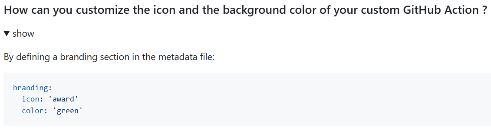{width="6.0in"
height="1.6333333333333333in"}

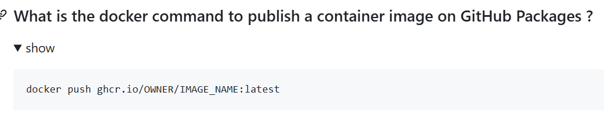{width="6.0in"
height="1.2375in"}

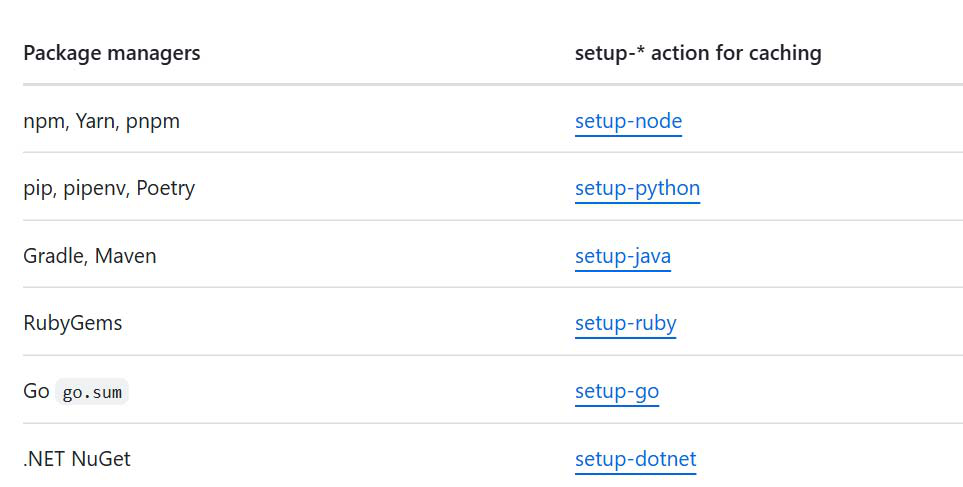{width="4.430555555555555in"
height="2.2416666666666667in"}

New Section 1 Page 2

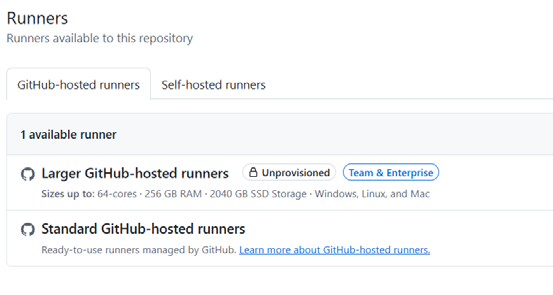{width="3.6847222222222222in"
height="1.9611100174978127in"}

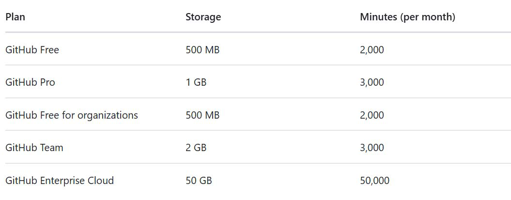{width="4.75in"
height="1.858332239720035in"}

Jobs that run on Windows and macOS runners that GitHub hosts consume
minutes at 2 and 10 times the rate that jobs on Linux runners consume.
For example, using 1,000 Windows minutes would consume 2,000 of the
minutes included in your account. Using 1,000 macOS minutes, would
consume 10,000 minutes included in your account.

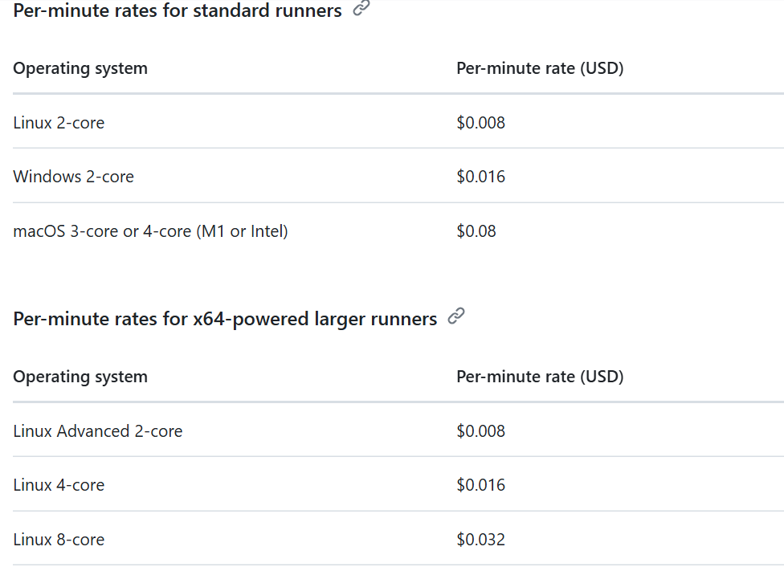{width="5.034722222222222in"
height="3.6680555555555556in"}

If GitHub Actions services are temporarily unavailable, then a workflow
run is discarded if it has not been queued within 30 minutes of being
triggered.

Linux‐ sudo, macos‐ brew, windows‐ choco

New Section 1 Page 3

Larger runners are not eligible for the use of included minutes on
private repositories. For both private and public repositories, when
larger runners are in use, they will always be billed at the per‐minute
rate.

Autoscaling is only available for larger runners with Linux or Windows
operating systems.

Private networking for GitHub‐hosted runners does not support static IP
addresses for larger runners.

You can use up to 10 larger runners with static IP address ranges in
total across all your larger runners.

If runners are unused for more than 30 days, their IP address ranges are
automatically removed and cannot be recovered.

Larger runners are only available for organizations and enterprises
using the GitHub Team or GitHub Enterprise Cloud plans.

Enterprise or organization owners can manage larger runners.

A self‐hosted runner is automatically removed from GitHub if it has not
connected to GitHub Actions for more than 14 days. An ephemeral
self‐hosted runner is automatically removed from GitHub if it has not
connected to GitHub Actions for more than 1 day.

Each job in a workflow can run for up to 5 days of execution time. If a
job reaches this limit, the job is terminated and fails to complete.

You can execute up to 1,000 requests to the GitHub API in an hour across
all actions within a repository. If requests are exceeded, additional
API calls will fail which might cause jobs to fail.

You can have a maximum of 10,000 self‐hosted runners in one runner
group. If this limit is reached, adding a new runner will not be
possible.

You must ensure that the machine has the appropriate network access with
at least 70 kilobits per second upload and download speed to communicate
with the GitHub hosts listed below.

The status can be one of the following:

> • **Idle:** The runner is connected to GitHub and is ready to execute
> jobs.
>
> • **Active:** The runner is currently executing a job.
>
> • **Offline:** The runner is not connected to GitHub. This could be
> because the machine is offline, the self‐hosted runner application is
> not running on the machine, or the self‐ hosted runner application
> cannot communicate with GitHub.

In addition to ‐‐check, you must provide two arguments to the script:

> • ‐‐url with the URL to your GitHub repository, organization, or
> enterprise. For example, ‐‐url
> [https://github.com/octo‐org/octo‐repo]{.underline}.
>
> • ‐‐pat with the value of a personal access token (classic), which
> must have\
> the workflow scope, or a fine‐grained personal access token with
> workflows read and write access.

You can use systemctl to check the service status:

New Section 1 Page 4

Actions Runner Controller (ARC) is a Kubernetes operator that
orchestrates and scales self‐hosted runners for GitHub Actions.

run: gh issue comment \"\$NUMBER\" ‐‐body \"\$BODY\"

GitHub Actions is available on all GitHub products, but GitHub Actions
is not available for private repositories owned by accounts using legacy
per‐repository plans.

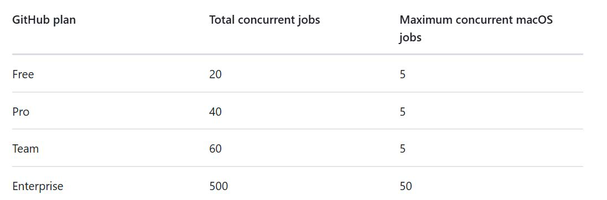{width="4.944444444444445in"
height="1.6361100174978127in"}

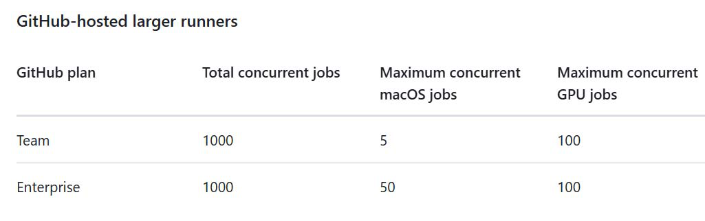{width="5.0625in"
height="1.5902777777777777in"}

# 🚀 GitHub Actions Guide

## 🔒 Disabling TLS Certification Verification
To disable TLS certification verification in the self-hosted runner application, set the following environment variable:
```sh
export GITHUB_ACTIONS_RUNNER_TLS_NO_VERIFY=1
```

## 📊 Monitoring Self-Hosted Runner
### 📝 Log Files
- Log files are stored in the `_diag` directory where you installed the runner.
- Each time the runner starts, a new log file is created with the format:
  ```
  Runner_<UTC_TIMESTAMP>.log
  ```
- Job-specific log files are also stored in `_diag`, beginning with `Worker_`.

### 📡 Real-Time Monitoring
- Use `journalctl` to monitor real-time activity:
  ```sh
  journalctl -u actions.runner.<runner-name> -f
  ```
- Use `systemctl` to check the service status:
  ```sh
  systemctl status actions.runner.<runner-name>
  ```

## 📦 Actions Runner Controller (ARC)
Actions Runner Controller (ARC) is a Kubernetes operator that orchestrates and scales self-hosted runners for GitHub Actions. Perfect for automating workflows at scale! 🚀

## 💬 Adding a Comment to an Issue
Use the following command to add a comment to a GitHub issue:
```sh
run: gh issue comment "$NUMBER" --body "$BODY"
```

## 🔐 GitHub Actions Availability
GitHub Actions is available on all GitHub products, **except** for private repositories under legacy per-repository plans.

## ⏳ Retention Periods
- **Public repositories**: Set retention between **1 - 90 days**.
- **Private repositories**: Set retention between **1 - 400 days**.
- **Workflow runs**: Stored for **400 days** before archival; permanently deleted **10 days after archival**.
- Retention changes **only apply to new artifacts and logs**; existing ones remain unchanged.

## 🛠️ Pattern Matching in GitHub Actions
| Pattern | Description |
|---------|-------------|
| `*` | Matches **zero or more characters**, but **not** `/`. Example: `Octo*` matches `Octocat`. |
| `**` | Matches **zero or more of any character**. |
| `?` | Matches **zero or one** of the preceding character. |
| `+` | Matches **one or more** of the preceding character. |
| `[]` | Matches **one alphanumeric character** listed in brackets or in ranges (`a-z`, `A-Z`, `0-9`). Example: `[CB]at` matches `Cat` or `Bat`. |
| `!` | Negates previous patterns if used at the start. No special meaning elsewhere. |

🚀 **Boost your GitHub Actions workflows with these insights!** 🔥

---
✨ *Happy Automating!* ✨


🎯 **Follow these best practices to optimize your GitHub Actions workflows and automate efficiently!** 🚀💡


## 🚀 Follow Me on LinkedIn & My Newsletter!  

Hey there! I'm **Vineet Rana**, a passionate **DevOps Engineer** 💻☁️. Let's connect and grow together!  

🔗 **LinkedIn:** [Vineet Rana](https://www.linkedin.com/in/vineetrana)  

📩 **Subscribe to my Newsletter:** [The DevOps Chronicles](https://www.linkedin.com/build-relation/newsletter-follow?entityUrn=7276114874349375488)  

🔥 Stay updated with the latest in **DevOps, AWS, and automation!** 🚀  

